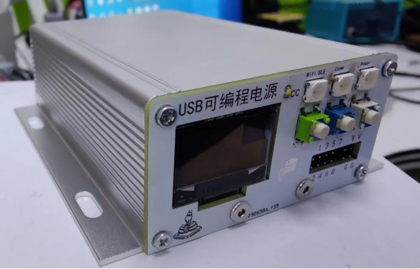
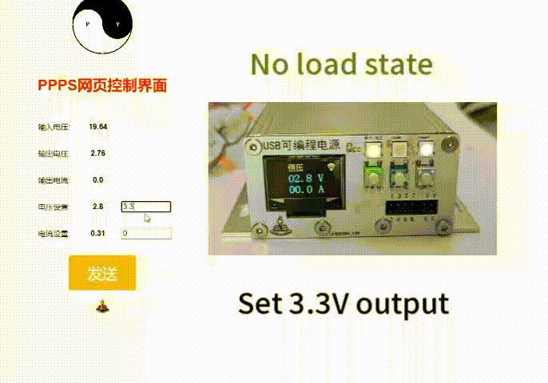

# Portable programmable power supply

Portable programmable power supply (PPPS) is a compact and efficient USB power supply. which uses USB type-c as input, supports PD mode, and the output range is 1-22V. It is controlled by USB, wifi, bluetooth, and supports data recording and remote control. It has the characteristics of low cost, high efficiency and easy to use, and can be used in embedded development, DIY, automatic testing and so on.

## Feature

- USB Type-C power supply with PD support
- step up/ step down mode
- Controlled by USB, Bluetooth, Wifi etc.
- Support remote control
- record runtime data and upload to the cloud
- Modular design
- high efficiency with Small size
- Secondary development using **micropython** / circuitpython
- Low cost
- OSHW

## Main chip

- MCU: ESP32-S3-wroom
- Power: SC8721A
- PD: CH224K

## Schematic diagram

**mcu module**

**power module**

**USB board**

**front panel**

**back panel**

## Development

**Software**
- micropython / circuitpython

**EDA**
- LCEDA

## License

 [PPPS](https://github.com/makediy/PPPS) © 2022 by Shaoziyang is licensed under [CC BY-SA 4.0](http://creativecommons.org/licenses/by-sa/4.0/?ref=chooser-v1).

---

**Demo1**

Control with webbrowser

